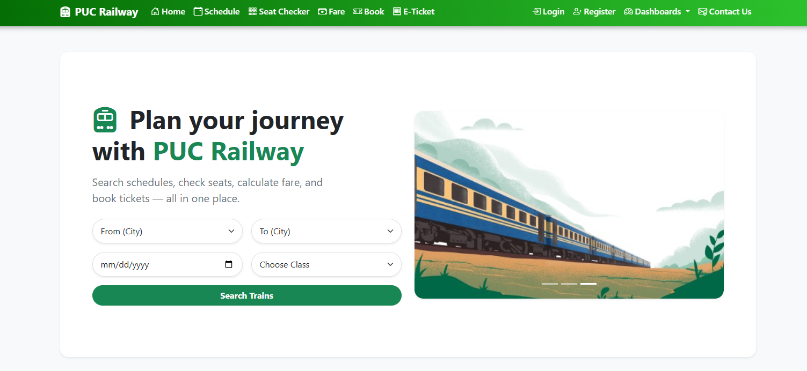
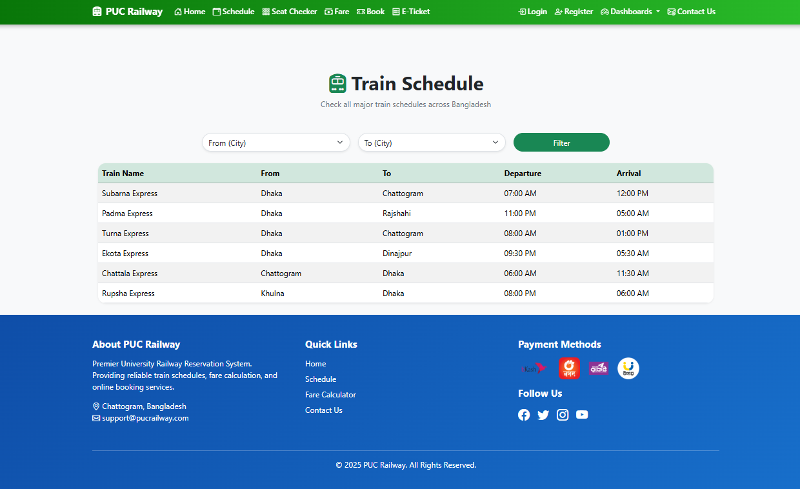

# 🚆 Railway Reservation System

[](https://laravel.com/)
[](https://www.php.net/)
[](https://getbootstrap.com/)
[](https://www.mysql.com/)
[](LICENSE)

A *Laravel-based Train Ticket Booking System* designed to provide *seamless ticket booking*, train schedule management, and passenger handling.  
Distinct dashboards for *Admin* and *Passenger* ensure secure and smooth operations.

---



## 👥 Team Members & Roles
| Name | Role |
|------|------|
| *Md Naim Uddin Mozumdar* | Team Leader & Developer |
| *Syed Nasibur Rahaman Ratul* | Backend Developer |
| *Shamraj Deb Nath* | Frontend Developer |
| *Shakwat Azam Shagor* | UI/UX Designer |

---

## 📌 Features

### 1️⃣ User Authentication
- Sign up, login, logout, profile update  
- Secure password hashing & validation  
- Admin & Passenger dashboards  

### 2️⃣ Train Schedule Module
- Train number, name, stops, departure & arrival times  
- Route mapping: Source → Destination with intermediate stations  

### 3️⃣ Ticket Booking System
- Select date, train, class, and number of passengers  
- Booking records stored for users & admin view  
- Automatic *E-ticket* generation with *PNR*  

### 4️⃣ Seat Availability Checker
- Classes: AC, Sleeper, General, etc.  

### 5️⃣ Fare Calculator
- Inputs: Distance, class type, passenger age  
- Optional discounts for children & senior citizens  

### 6️⃣ Admin Panel
- Add/edit trains, view bookings, manage users  
- Revenue & usage reports  

### 7️⃣ Passenger Module
- Name, age, ID proof, contact details  
- Searchable by train/date  

### 8️⃣ Ticket Cancellation & Refund
- Rules based on booking status & timing  

---

## 🛠 Technologies Used
- *Laravel 11* – Backend MVC  
- *Blade Templates* – Frontend Views  
- *Bootstrap 5* – Responsive Design  
- *MySQL* – Database  
- *PHP 8.2+* – Core Language  
- *Git* – Version Control  

---
🎯 Future Improvements

💳 Online Payment Gateway (bKash, Nagad, Card)

📧 SMS / Email Notifications

📊 Advanced Reports & Analytics

🌐 Multi-language Support

📞 Contact

📧 Email: uddinmdnaim10@gmail.com

📱 Phone: +8801833515057

## ⚙ Installation Guide

1. *Clone the repository*  
```bash
git clone https://github.com/your-repo/railway-management-system.git
cd railway-management-system

2. Install dependencies
composer install
npm install && npm run dev

3.Environment setup
 cp .env.example .env
php artisan key:generate

Update database credentials in .env.

4.Run migrations
  php artisan migrate

5.Start server
 php artisan serve


Visit http://127.0.0.1:8000
